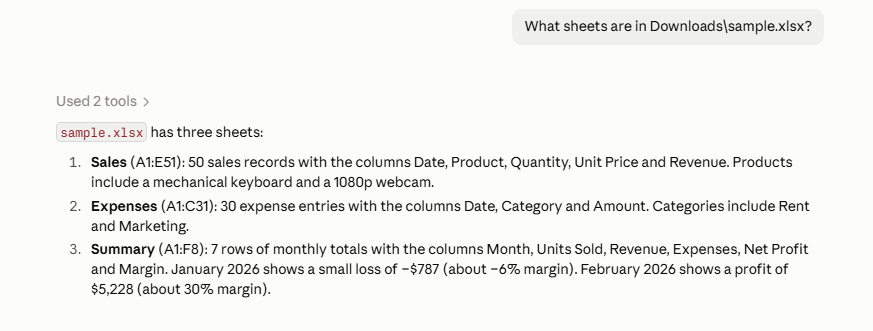
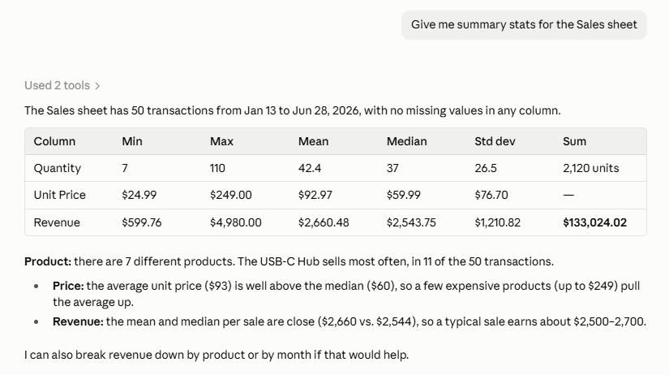
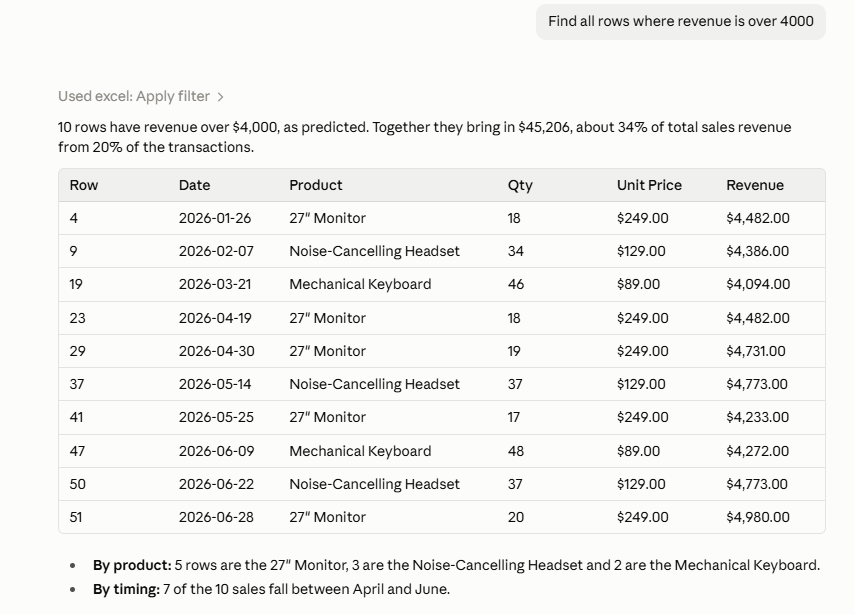

# Excel MCP Server

**by [DWS Build](https://github.com/eschaq)** · [GitHub](https://github.com/eschaq/excel-mcp-server) · [Claude Marketplace listing](#) *(coming soon)*

Let Claude open, analyze and edit spreadsheets on your computer. This [MCP](https://modelcontextprotocol.io) server gives Claude ten tools for working with `.xlsx`, `.xlsm`, `.xls` and `.csv` files: reading sheets, filtering and searching rows, computing summary statistics, inspecting formulas, and writing values, formulas, sheets and new workbooks. Everything runs locally over stdio. It needs no Microsoft Office, and it only touches files inside the folders you allow. The server itself makes no network connections; the only downloads are the one-time install described in [What gets downloaded](#what-gets-downloaded).

## Screenshots

**Exploring a workbook.** Claude calls `read_spreadsheet` to see sheets, ranges and contents:



**Summary statistics.** `get_summary_stats` returns min, max, mean, median, stdev and sum per column:



**Filtering rows.** `apply_filter` finds matching rows, returned with their Excel row numbers:



---

## Install as a Claude Code plugin (recommended)

### Requirements

- **[uv](https://docs.astral.sh/uv/getting-started/installation/)**. The plugin starts its server with `uv run --frozen`, which installs the exact dependency versions in this repository's `uv.lock` on first launch (see [What gets downloaded](#what-gets-downloaded)), so you don't install anything else yourself.

  ```bash
  # macOS / Linux
  curl -LsSf https://astral.sh/uv/install.sh | sh
  ```

  ```powershell
  # Windows
  powershell -ExecutionPolicy ByPass -c "irm https://astral.sh/uv/install.ps1 | iex"
  ```

  Open a new terminal afterwards and check that `uv --version` works.

### Install

This repository is its own plugin marketplace. In your shell:

```bash
claude plugin marketplace add eschaq/excel-mcp-server
claude plugin install dws-spreadsheet@dws-build
```

Or inside a Claude Code session:

```text
/plugin marketplace add eschaq/excel-mcp-server
/plugin install dws-spreadsheet@dws-build
```

Start a new session (or run `/reload-plugins`) and ask Claude about a spreadsheet. The first launch takes a few seconds while uv installs the dependencies; after that it starts quickly.

### Settings

Installing doesn't prompt for these. Any option you haven't set uses its default, shown below. To change them, run `/plugin configure dws-spreadsheet@dws-build` in a Claude Code session:

| Setting | Default | Effect |
|---|---|---|
| Allowed folder | your home folder | Claude can only open spreadsheets inside this folder and its subfolders |
| Read-only mode | off | Hides the write tools, so Claude can read and analyze files but never change them |
| Max file size (MB) | 50 | Larger files are refused |

### What gets downloaded

The server never connects to the network. Installing and starting it downloads the following, once:

- **Python packages from PyPI** (`https://pypi.org/simple`, with files served from `files.pythonhosted.org`): the 30 packages pinned, with their hashes, in [`uv.lock`](uv.lock). These are `mcp` 2.2.0, `openpyxl` 3.1.5 and `xlrd` 2.0.2, plus their dependencies (for example `pydantic`, `anyio`, `starlette` and `et-xmlfile`; `pywin32` on Windows only). `--frozen` makes uv install exactly those versions and never re-resolve them, and uv checks each file against its hash in the lockfile.
- **Python itself, only if needed.** If you don't have Python 3.11 or newer, uv downloads a standalone CPython build from GitHub ([astral-sh/python-build-standalone](https://github.com/astral-sh/python-build-standalone)).

uv keeps the downloads in its cache (`~/.cache/uv` on macOS/Linux, `%LOCALAPPDATA%\uv\cache` on Windows) and installs them into a virtual environment in the plugin's data folder (`~/.claude/plugins/data/`). The plugin's own code runs straight from the plugin folder and isn't downloaded or built. Later launches reuse the installed environment and download nothing. Installing uv itself is a separate step you run yourself (see [Requirements](#requirements)).

### Update or remove

```bash
claude plugin update dws-spreadsheet@dws-build
claude plugin uninstall dws-spreadsheet@dws-build
```

## Install for Claude Desktop

Requires Python 3.11+. Install from source:

```bash
git clone https://github.com/eschaq/excel-mcp-server
cd excel-mcp-server
python -m venv .venv
.venv\Scripts\activate          # macOS/Linux: source .venv/bin/activate
pip install -e .
```

### Claude Desktop configuration

Open **Settings → Developer → Edit Config** in Claude Desktop and add:

```json
{
  "mcpServers": {
    "excel": {
      "command": "C:\\path\\to\\excel-mcp-server\\.venv\\Scripts\\python.exe",
      "args": [
        "-m", "excel_mcp.server",
        "--allow-dir", "C:\\Users\\you\\Documents",
        "--allow-dir", "C:\\Users\\you\\Downloads"
      ]
    }
  }
}
```

On macOS/Linux use the venv's `bin/python` instead. Point `command` at the Python interpreter where the package is installed, since a bare `"python"` may resolve to a different interpreter (or, on Windows, to the Microsoft Store stub). Restart Claude Desktop after saving.

If you have uv, you can skip the venv: use `"command": "uv"` with `"args": ["run", "--frozen", "--project", "C:\\path\\to\\excel-mcp-server", "python", "-m", "excel_mcp.server", "--allow-dir", "C:\\Users\\you\\Documents"]` and `"env": {"PYTHONPATH": "C:\\path\\to\\excel-mcp-server\\src"}`.

### Server options

| Flag | Environment variable | Default | Effect |
|---|---|---|---|
| `--allow-dir DIR` (repeatable) | `EXCEL_MCP_ALLOWED_DIRS` (`;`-separated on Windows, `:` elsewhere) | your home folder | Only files inside these folders can be read or written |
| `--read-only` | `EXCEL_MCP_READ_ONLY=1` | off | Write tools are removed entirely. Read-only if either the flag or the variable asks for it; neither can switch it off |
| `--max-file-mb N` | `EXCEL_MCP_MAX_FILE_MB` | `50` | Files larger than this are refused |
| `--log-file PATH` | `EXCEL_MCP_LOG_FILE` | `~/.excel-mcp/excel-mcp.log` | Audit log of every file operation |

Relative paths passed to tools resolve against the first allowed folder.

## Tools

| Tool | What it does | Parameters |
|---|---|---|
| `read_spreadsheet` | List sheets with row/column counts, used range and a preview | `path`, `preview_rows`=5 |
| `get_sheet_data` | Return rows as JSON records, with paging and column selection | `path`, `sheet`, `header_row`=1, `columns`, `offset`=0, `limit`=500 |
| `get_summary_stats` | Count, missing, min, max, mean, median, sample stdev (like `STDEV.S`) and sum for numeric columns; unique/top values for text; earliest/latest for dates | `path`, `sheet`, `header_row`=1, `columns` |
| `apply_filter` | Return rows matching column conditions | `path`, `conditions`, `sheet`, `header_row`=1, `match`=`all`\|`any`, `columns`, `limit`=500 |
| `search` | Find cells matching text, a number or a regex, across one or all sheets | `path`, `query`, `sheet`, `mode`=`contains`\|`exact`\|`regex`, `case_sensitive`, `limit`=100 |
| `get_formulas` | List formulas in a range with their cached results (.xlsx/.xlsm) | `path`, `cell_range`, `sheet` |
| `write_cell` ✏️ | Write a value or formula to one cell; returns the old value | `path`, `cell`, `value`, `sheet` |
| `write_range` ✏️ | Write a 2D block of values starting at a cell | `path`, `start_cell`, `values`, `sheet` |
| `create_sheet` ✏️ | Add a sheet, optionally with a header row | `path`, `name`, `headers`, `index` |
| `create_workbook` ✏️ | Create a new .xlsx with an optional bold, frozen header row | `path`, `sheet_name`=`Sheet1`, `headers`, `overwrite`=false |

✏️ = write tool: .xlsx/.xlsm only, and hidden in `--read-only` mode.

**Filter operators:** `eq`, `ne`, `gt`, `gte`, `lt`, `lte`, `between` (`[low, high]`), `contains`, `not_contains`, `startswith`, `endswith`, `regex`, `in`, `not_in` (list), `is_null`, `not_null`. Text comparisons ignore case unless `case_sensitive` is set; dates compare against ISO strings such as `"2026-01-31"`.

```json
{
  "path": "sales.xlsx",
  "conditions": [
    { "column": "Region", "op": "in", "value": ["West", "North"] },
    { "column": "Date", "op": "gte", "value": "2026-02-01" }
  ],
  "columns": ["Rep", "Units", "Date"]
}
```

Every data row comes back with a `_row` key holding its Excel row number, so Claude can write results back to the right cell.

## Example prompts

- *"What's in `Q3-budget.xlsx`? Summarize each sheet."*
- *"In `sales.xlsx`, which reps sold more than 100 units in the West region since March?"*
- *"Give me summary stats for the Revenue and Margin columns."*
- *"Find every cell mentioning 'Acme Corp' across all sheets."*
- *"Show me the formulas in the Totals sheet and check whether any reference the wrong rows."*
- *"Add a Summary sheet with total units per region, using SUMIF formulas."*
- *"Create `contacts.xlsx` with columns Name, Email and Company, then add these 20 people: …"*
- *"Convert `export.csv` into a formatted Excel workbook."*

## Security

- **Sandboxed paths.** Every path is fully resolved (`..` collapsed, symlinks followed) and must fall inside an allowed folder. Anything else is refused.
- **File types.** Only `.xlsx`, `.xlsm`, `.xls` and `.csv` can be opened; writes are limited to `.xlsx`/`.xlsm`.
- **Size limit.** Files over `--max-file-mb` are refused before they are loaded.
- **Read-only mode.** `--read-only` removes the write tools from the server entirely, so Claude never sees them.
- **Local only.** stdio transport, and the server makes no network calls. The one-time dependency install is listed under [What gets downloaded](#what-gets-downloaded).
- **Audit log.** Each operation is logged with its resolved path to stderr and to the log file.
- **Safe saves.** Writes go to a temp file that then replaces the original, so an interrupted save can't leave a half-written workbook.

## Limitations

- **Dates are written the way Excel types them.** An ISO string such as `"2026-07-01"` becomes a real date; start it with an apostrophe (`"'2026-07-01"`) to keep it as text.
- **Formulas aren't recalculated.** The server stores formulas but doesn't compute them. Files saved by Excel carry cached results, which the read tools return. A formula written by this server (or any other openpyxl-based tool) reads back as empty until the file is opened and saved in Excel or LibreOffice. `get_formulas` always shows the formula text.
- **Editing can drop some features.** Writes use openpyxl, which preserves values, formulas, styles, merged cells and VBA (for .xlsm), but drops charts, images and shapes from the edited workbook. Keep a copy of complex workbooks, or use `--read-only` for them.
- **Close the file in Excel before writing.** On Windows, Excel locks open files; the server reports a clear error if it can't save.
- `.xls` and `.csv` files are read-only. To edit one, ask Claude to copy it into a new `.xlsx`.

## Development

```bash
pip install -e ".[dev]"
pytest                                  # unit tests plus in-process MCP protocol tests
python tests/fixtures/make_sample.py    # regenerate test fixtures (the .xls needs: pip install xlwt)
claude plugin validate . --strict       # check the marketplace manifest
claude plugin validate .claude-plugin/plugin.json --strict   # check the plugin manifest
```

Layout: `excel_ops.py` holds all spreadsheet logic with no MCP dependency, `tools.py` defines the MCP tools, and `server.py` is the CLI entry point. `.claude-plugin/` holds the plugin and marketplace manifests.

### Evals

`evals/` holds 20 [`claude plugin eval`](https://code.claude.com/docs/en/plugin-evals) cases: every tool, edge cases (an empty sheet, a missing file, text/number/date writes), and security checks (a path outside the allowed folder, a file over 50 MB, read-only mode, a non-spreadsheet file). They run real Claude sessions against the real server, so they cost money: about $9 for the full suite at 3 runs per case. They need `uv` and bash on your PATH.

```bash
bash evals/prepare-readonly-plugin.sh    # once: generates the read-only test plugin (gitignored)
claude plugin eval . --scaffold --allow-real-servers \
  --allow-tools "mcp__plugin_dws-spreadsheet_excel__*" "mcp__plugin_dws-spreadsheet-readonly_excel__*" \
  --ablation none --judge-model sonnet --max-cost-usd 15
```

- `--scaffold` runs each case's `setup.sh`, which copies `evals/fixtures/eval_workbook.xlsx` (or generates a test file) into the run's workspace.
- `--allow-real-servers` starts the real server instead of mocks.
- The read-only case loads a test copy of the plugin whose server runs with `--read-only`. `evals/prepare-readonly-plugin.sh` generates it in `evals/security-read-only-mode/readonly-plugin/`, which is gitignored so the repository holds only one `plugin.json`.

## License

MIT © DWS Build
